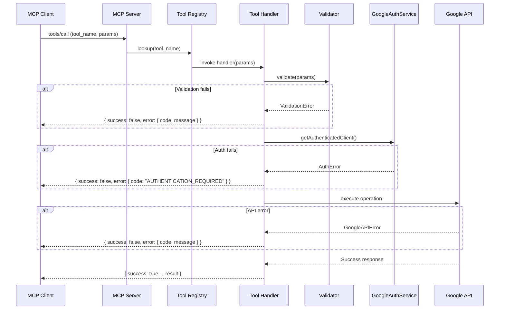
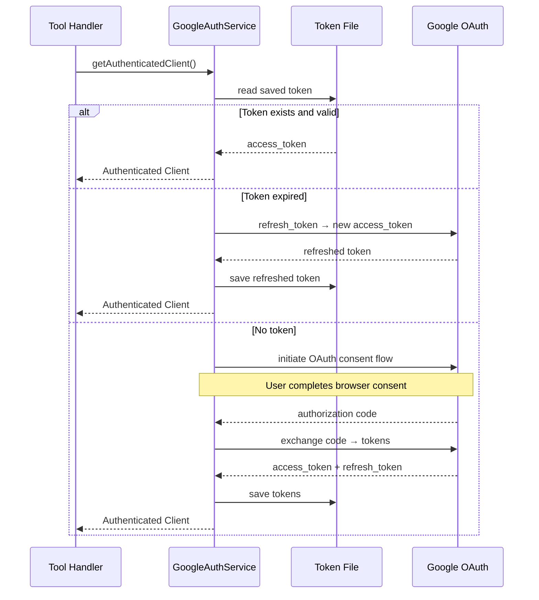
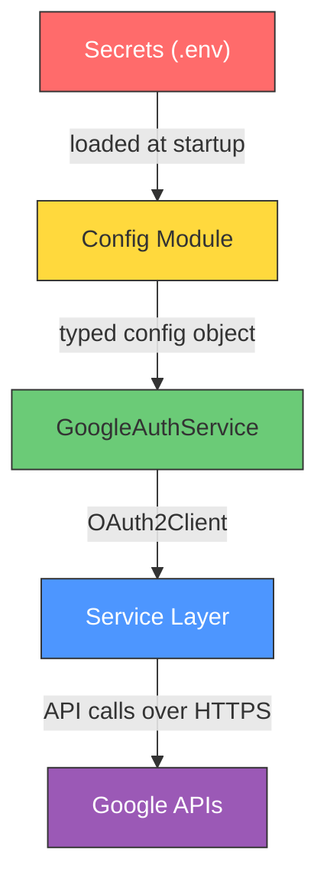
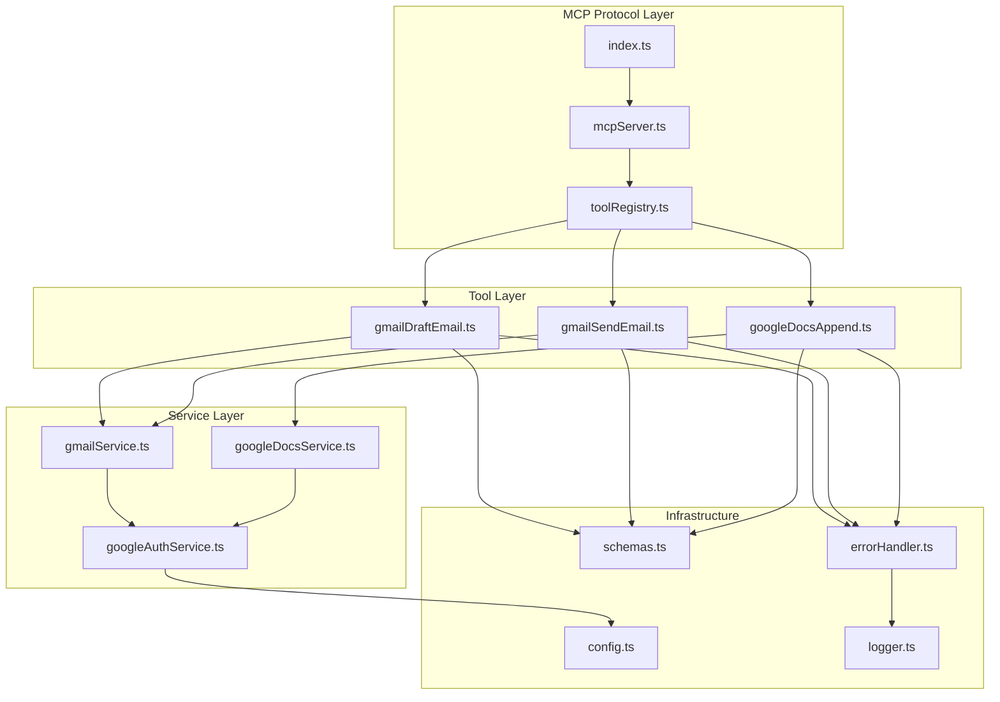

# Architecture – MCP Google Workspace Server

> **Language:** TypeScript / Node.js
> **MCP SDK:** `@modelcontextprotocol/sdk`
> **Google Client:** `googleapis` (official Node.js library)
> **Transport (initial):** stdio (local dev) — switchable to SSE/HTTP for remote deployment

---

## 1. System Overview

This MCP server is a **generic, agent-agnostic integration layer** between any MCP-compatible AI client and Google Workspace APIs (Gmail + Google Docs).

```
┌──────────────────────────────────┐
│         MCP Client               │
│  (Cursor, Claude, custom agent)  │
└──────────────┬───────────────────┘
               │  MCP Protocol (stdio / SSE)
               ▼
┌──────────────────────────────────┐
│          MCP Server              │
│                                  │
│  ┌────────────────────────────┐  │
│  │      Tool Registry         │  │
│  │  ┌──────────┐ ┌──────────┐│  │
│  │  │ Gmail    │ │ Docs     ││  │
│  │  │ Tools    │ │ Tools    ││  │
│  │  └────┬─────┘ └────┬─────┘│  │
│  └───────┼─────────────┼──────┘  │
│          │             │         │
│  ┌───────┴─────────────┴──────┐  │
│  │    Validation Layer        │  │
│  └───────┬─────────────┬──────┘  │
│          │             │         │
│  ┌───────┴─────────────┴──────┐  │
│  │    Google Auth Service     │  │
│  │    (OAuth 2.0, token mgmt) │  │
│  └───────┬─────────────┬──────┘  │
│          │             │         │
│  ┌───────┴──────┐ ┌────┴───────┐ │
│  │ Gmail Service│ │ Docs Svc   │ │
│  └──────────────┘ └────────────┘ │
│                                  │
│  ┌────────────────────────────┐  │
│  │  Error Handler  │ Logger   │  │
│  └────────────────────────────┘  │
└──────────────────────────────────┘
               │
    ┌──────────┴──────────┐
    ▼                     ▼
┌──────────┐       ┌────────────┐
│ Gmail API│       │ Docs API   │
└──────────┘       └────────────┘
```

### Key Architectural Principles

| Principle        | Description                                                                 |
| ---------------- | --------------------------------------------------------------------------- |
| **Generic**      | No agent-specific logic. Any MCP client can discover and use the tools.     |
| **Discoverable** | All tools self-describe via MCP schemas (name, description, input, output). |
| **Stateless**    | No per-agent session state. Auth tokens are managed centrally.              |
| **Extensible**   | New Google Workspace tools can be added by dropping in a tool + service.    |
| **Secure**       | Least-privilege OAuth, no token logging, env-driven secrets.               |

---

## 2. Component Architecture

### 2.1 Layered Design

The server is organized into four horizontal layers, each with a single responsibility:

```
┌─────────────────────────────────────────────┐
│  Layer 1 — MCP Protocol Layer               │
│  (Server bootstrap, transport, routing)     │
├─────────────────────────────────────────────┤
│  Layer 2 — Tool Layer                       │
│  (Tool definitions, input mapping, output)  │
├─────────────────────────────────────────────┤
│  Layer 3 — Service Layer                    │
│  (Business logic, API orchestration)        │
├─────────────────────────────────────────────┤
│  Layer 4 — Infrastructure Layer             │
│  (Auth, config, logging, error handling)    │
└─────────────────────────────────────────────┘
```

### 2.2 Component Descriptions

#### Layer 1 — MCP Protocol Layer

| Component          | Responsibility                                                          |
| ------------------ | ----------------------------------------------------------------------- |
| `mcpServer.ts`     | Bootstraps `@modelcontextprotocol/sdk` Server, configures transport.    |
| `toolRegistry.ts`  | Registers all tools with the MCP server, provides discovery metadata.   |

- Uses `StdioServerTransport` for local development.
- Transport is abstracted so SSE or HTTP can be swapped in later.
- Exposes `tools/list` and `tools/call` MCP endpoints.

#### Layer 2 — Tool Layer

Each tool is a self-contained module exporting:
- **name** — namespaced identifier (e.g., `gmail_draft_email`)
- **description** — LLM-readable purpose string
- **inputSchema** — JSON Schema for parameters
- **handler** — async function: `(params) → MCPToolResult`

| Tool                 | Purpose                         | Inputs                             |
| -------------------- | ------------------------------- | ---------------------------------- |
| `gmail_draft_email`  | Create a Gmail draft            | `to`, `subject`, `body`            |
| `gmail_send_email`   | Send an email via Gmail         | `to`, `subject`, `body`            |
| `google_docs_append` | Append text to a Google Doc     | `documentId`, `content`            |

> **Draft vs. Send Safety:** These are separate tools by design. The server never auto-promotes a draft to a send. The AI agent's intent determines which tool is called.

#### Layer 3 — Service Layer

Services encapsulate all Google API interaction. Tools never call Google APIs directly.

| Service               | Responsibility                                                      |
| --------------------- | ------------------------------------------------------------------- |
| `GmailService`        | Constructs RFC 2822/MIME messages, calls Gmail Draft/Send endpoints. |
| `GoogleDocsService`   | Resolves doc end-index, builds `batchUpdate` append requests.       |
| `GoogleAuthService`   | Manages OAuth 2.0 flow, token refresh, credential lifecycle.        |

#### Layer 4 — Infrastructure Layer

| Component        | Responsibility                                                          |
| ---------------- | ----------------------------------------------------------------------- |
| `config.ts`      | Loads env vars, validates required config, exports typed config object.  |
| `errorHandler.ts`| Translates Google API / internal errors into structured MCP responses.   |
| `logger.ts`      | Structured logging (tool, timestamp, status). Redacts secrets.          |
| `schemas.ts`     | Zod schemas for email addresses, document IDs, required fields.         |

---

## 3. Data Flow

### 3.1 Tool Invocation Sequence



### 3.2 Authentication Flow



---

## 4. Project Structure

```
mcp-google-workspace/
│
├── src/
│   ├── index.ts                    # Entry point — bootstrap server
│   │
│   ├── server/
│   │   ├── mcpServer.ts            # MCP Server setup + transport
│   │   └── toolRegistry.ts         # Registers tools, handles discovery
│   │
│   ├── tools/
│   │   ├── gmailDraftEmail.ts      # gmail_draft_email tool definition
│   │   ├── gmailSendEmail.ts       # gmail_send_email tool definition
│   │   └── googleDocsAppend.ts     # google_docs_append tool definition
│   │
│   ├── services/
│   │   ├── googleAuthService.ts    # OAuth 2.0 + token management
│   │   ├── gmailService.ts         # Gmail API interactions
│   │   └── googleDocsService.ts    # Docs API interactions
│   │
│   ├── validation/
│   │   └── schemas.ts              # Zod schemas for all tool inputs
│   │
│   ├── errors/
│   │   ├── errorCodes.ts           # Enum of structured error codes
│   │   └── errorHandler.ts         # Error translation + formatting
│   │
│   ├── config/
│   │   └── config.ts               # Env var loader + validation
│   │
│   └── utils/
│       └── logger.ts               # Structured logger (redacts secrets)
│
├── tests/
│   ├── tools/
│   │   ├── gmailDraftEmail.test.ts
│   │   ├── gmailSendEmail.test.ts
│   │   └── googleDocsAppend.test.ts
│   │
│   ├── services/
│   │   ├── gmailService.test.ts
│   │   └── googleDocsService.test.ts
│   │
│   └── validation/
│       └── schemas.test.ts
│
├── .env.example
├── .gitignore
├── tsconfig.json
├── package.json
├── README.md
└── Docs/
    ├── ProblemStatement.md
    └── architecture.md
```

---

## 5. Tool Schemas (MCP)

Each tool is registered with a JSON Schema that MCP clients use for discovery.

### 5.1 `gmail_draft_email`

```json
{
  "name": "gmail_draft_email",
  "description": "Create a draft email in the authenticated user's Gmail account.",
  "inputSchema": {
    "type": "object",
    "properties": {
      "to": {
        "type": "array",
        "items": { "type": "string", "format": "email" },
        "description": "One or more recipient email addresses.",
        "minItems": 1
      },
      "subject": {
        "type": "string",
        "description": "Email subject line."
      },
      "body": {
        "type": "string",
        "description": "Email body content (plain text)."
      }
    },
    "required": ["to", "subject", "body"]
  }
}
```

### 5.2 `gmail_send_email`

```json
{
  "name": "gmail_send_email",
  "description": "Send an email using the authenticated user's Gmail account. This is a side-effecting operation — use gmail_draft_email if the user only wants to prepare a draft.",
  "inputSchema": {
    "type": "object",
    "properties": {
      "to": {
        "type": "array",
        "items": { "type": "string", "format": "email" },
        "description": "One or more recipient email addresses.",
        "minItems": 1
      },
      "subject": {
        "type": "string",
        "description": "Email subject line."
      },
      "body": {
        "type": "string",
        "description": "Email body content (plain text)."
      }
    },
    "required": ["to", "subject", "body"]
  }
}
```

### 5.3 `google_docs_append`

```json
{
  "name": "google_docs_append",
  "description": "Append text to the end of an existing Google Doc.",
  "inputSchema": {
    "type": "object",
    "properties": {
      "documentId": {
        "type": "string",
        "description": "The Google Docs document ID."
      },
      "content": {
        "type": "string",
        "description": "Text content to append to the document.",
        "minLength": 1
      }
    },
    "required": ["documentId", "content"]
  }
}
```

---

## 6. Authentication Architecture

### 6.1 OAuth 2.0 Design

```
                ┌──────────────────────┐
                │  GoogleAuthService   │
                │                      │
                │  • initiate flow     │
                │  • exchange code     │
                │  • refresh tokens    │
                │  • get auth client   │
                └──────────┬───────────┘
                           │
              ┌────────────┴────────────┐
              │                         │
              ▼                         ▼
    ┌──────────────────┐     ┌──────────────────┐
    │  Token Store     │     │  Google OAuth     │
    │  (local file)    │     │  Endpoints        │
    └──────────────────┘     └──────────────────┘
```

### 6.2 OAuth Scopes (Least Privilege)

| Scope                                              | Purpose               |
| -------------------------------------------------- | --------------------- |
| `https://www.googleapis.com/auth/gmail.compose`    | Create Gmail drafts   |
| `https://www.googleapis.com/auth/gmail.send`       | Send emails via Gmail |
| `https://www.googleapis.com/auth/documents`        | Append to Google Docs |

### 6.3 Credential Configuration

All credentials are supplied via environment variables. Never hardcoded, never committed.

```
GOOGLE_CLIENT_ID=<from Google Cloud Console>
GOOGLE_CLIENT_SECRET=<from Google Cloud Console>
GOOGLE_REDIRECT_URI=http://localhost:3000/oauth/callback
GOOGLE_TOKEN_STORE=./tokens.json
```

### 6.4 Auth Sharing

`GoogleAuthService` is a **singleton**. All tools request an authenticated `OAuth2Client` through it, ensuring:
- Token refresh happens once, not per-tool.
- No duplication of auth logic inside tool handlers.

---

## 7. Error Handling Strategy

### 7.1 Error Code Taxonomy

| Code                      | HTTP Analogy | When                                       |
| ------------------------- | ------------ | ------------------------------------------ |
| `VALIDATION_ERROR`        | 400          | Missing/invalid input parameters           |
| `INVALID_RECIPIENT`       | 400          | Email address fails format validation      |
| `AUTHENTICATION_REQUIRED` | 401          | No valid OAuth token available             |
| `INSUFFICIENT_PERMISSION` | 403          | User lacks access to the resource          |
| `DOCUMENT_NOT_FOUND`      | 404          | Document ID does not resolve               |
| `GOOGLE_API_ERROR`        | 502          | Upstream Google API failure                |
| `INTERNAL_ERROR`          | 500          | Unexpected server error                    |

### 7.2 Error Response Shape

All errors conform to a consistent structure:

```json
{
  "success": false,
  "error": {
    "code": "INVALID_RECIPIENT",
    "message": "One or more recipient email addresses are invalid."
  }
}
```

### 7.3 Error Flow

```
Tool Handler
    │
    ├── Validation error?  → return { success: false, error: { code, message } }
    ├── Auth error?        → return { success: false, error: { code, message } }
    ├── Google API error?  → errorHandler.translate(err) → structured error
    └── Unexpected error?  → errorHandler.wrap(err) → generic INTERNAL_ERROR
```

> **Security rule:** Raw Google API error details (stack traces, internal codes) are never exposed to the MCP client. The `errorHandler` translates them into safe, user-facing messages.

---

## 8. Validation Layer

### 8.1 Strategy

Validation runs **before** any Google API call. This avoids wasted API quota and provides fast, deterministic feedback.

### 8.2 Validation Rules

#### Gmail Tools (`gmail_draft_email`, `gmail_send_email`)

| Field     | Rule                                           |
| --------- | ---------------------------------------------- |
| `to`      | Required, array, ≥ 1 item, each valid email    |
| `subject` | Required, non-empty string                     |
| `body`    | Required, non-empty string                     |

#### Google Docs Tool (`google_docs_append`)

| Field        | Rule                        |
| ------------ | --------------------------- |
| `documentId` | Required, non-empty string  |
| `content`    | Required, non-empty string  |

### 8.3 Implementation

Use [Zod](https://github.com/colinhacks/zod) for runtime schema validation:

```typescript
// Example: Gmail input schema
const gmailInputSchema = z.object({
  to: z.array(z.string().email()).min(1),
  subject: z.string().min(1),
  body: z.string().min(1),
});
```

Zod provides typed parse results and human-readable error messages out of the box.

---

## 9. Observability

### 9.1 Structured Logging

Each log entry includes:

| Field       | Example                      |
| ----------- | ---------------------------- |
| `timestamp` | `2026-09-04T12:00:00.000Z`  |
| `level`     | `INFO` / `ERROR` / `WARN`   |
| `tool`      | `gmail_send_email`           |
| `event`     | `started` / `completed`     |
| `durationMs`| `342`                        |
| `error`     | `DOCUMENT_NOT_FOUND` (if applicable) |

### 9.2 Log Examples

```
INFO  [gmail_send_email] started  recipient_count=2
INFO  [gmail_send_email] completed  durationMs=412  messageId=1234abc
ERROR [google_docs_append] failed  code=DOCUMENT_NOT_FOUND  durationMs=156
```

### 9.3 Redaction Rules

The logger **must never output**:
- OAuth access tokens
- OAuth refresh tokens
- Client secrets
- Full email bodies (truncate or omit)
- Any PII beyond what is essential for debugging (e.g., recipient email is acceptable)

---

## 10. Security Architecture



| Security Requirement                  | Implementation                                      |
| ------------------------------------- | --------------------------------------------------- |
| No hardcoded credentials              | All secrets from `.env` / env vars                  |
| No secrets in source control          | `.gitignore` includes `.env`, `tokens.json`         |
| No token logging                      | Logger redaction rules enforced                     |
| Least-privilege OAuth                 | Only `gmail.compose`, `gmail.send`, `documents`     |
| Input validation before API calls     | Zod schemas validate all tool inputs                |
| Error sanitization                    | `errorHandler` strips internal Google error details |
| HTTPS for production                  | Google APIs enforce TLS; server transport is configurable |
| Token storage                         | Local file with restricted permissions              |

---

## 11. MCP Transport Strategy

### 11.1 Initial: stdio

For local development with MCP clients like Cursor:

```json
{
  "mcpServers": {
    "google-workspace": {
      "command": "node",
      "args": ["dist/index.js"],
      "env": {
        "GOOGLE_CLIENT_ID": "...",
        "GOOGLE_CLIENT_SECRET": "..."
      }
    }
  }
}
```

### 11.2 Future: SSE / HTTP

The transport is abstracted in `mcpServer.ts`. Switching to SSE requires only changing the transport initialization — no tool or service changes.

```typescript
// Current (stdio)
const transport = new StdioServerTransport();

// Future (SSE)
// const transport = new SSEServerTransport("/mcp", response);
```

---

## 12. Extensibility Model

### 12.1 Adding a New Tool

To add a new capability (e.g., `gmail_search_emails`):

```
1. Create  src/tools/gmailSearchEmails.ts       ← tool definition + handler
2. Create  src/services/gmailService.ts          ← add searchEmails() method
3. Update  src/validation/schemas.ts             ← add input schema
4. Update  src/server/toolRegistry.ts            ← register the new tool
5. Create  tests/tools/gmailSearchEmails.test.ts ← unit tests
```

No changes to the MCP server bootstrap, auth service, or error handler.

### 12.2 Adding a New Google Workspace Service

To add support for a new service (e.g., Google Sheets):

```
1. Add OAuth scope to GoogleAuthService
2. Create  src/services/googleSheetsService.ts
3. Create  src/tools/googleSheets*.ts
4. Register tools in toolRegistry.ts
```

### 12.3 Future Tool Map

```
Gmail                          Google Docs
├── gmail_draft_email    ✅    ├── google_docs_append     ✅
├── gmail_send_email     ✅    ├── google_docs_read       🔮
├── gmail_search_emails  🔮    ├── google_docs_create     🔮
├── gmail_read_email     🔮    └── google_docs_update     🔮
├── gmail_reply_email    🔮
└── gmail_forward_email  🔮    Google Sheets              🔮
                               Google Calendar            🔮

✅ = Initial version    🔮 = Future
```

---

## 13. Technology Stack

| Category        | Choice                             | Rationale                                      |
| --------------- | ---------------------------------- | ---------------------------------------------- |
| Language        | TypeScript                         | Type safety, strong MCP SDK support            |
| Runtime         | Node.js (≥ 18)                     | LTS, native ES module support                  |
| MCP SDK         | `@modelcontextprotocol/sdk`        | Official MCP SDK for TypeScript                |
| Google APIs     | `googleapis`                       | Official Google API client for Node.js         |
| Validation      | `zod`                              | Runtime type-safe schema validation            |
| Logging         | Custom structured logger           | Lightweight, redaction-aware                   |
| Testing         | `vitest`                           | Fast, TypeScript-native, built-in mocking      |
| Build           | `tsc`                              | Standard TypeScript compilation                |
| Package Manager | `npm`                              | Default Node.js package manager                |

---

## 14. Configuration Reference

### Environment Variables

| Variable               | Required | Description                              | Default                            |
| ---------------------- | -------- | ---------------------------------------- | ---------------------------------- |
| `GOOGLE_CLIENT_ID`     | Yes      | OAuth 2.0 client ID                      | —                                  |
| `GOOGLE_CLIENT_SECRET` | Yes      | OAuth 2.0 client secret                  | —                                  |
| `GOOGLE_REDIRECT_URI`  | Yes      | OAuth redirect URI                       | `http://localhost:3000/oauth/callback` |
| `GOOGLE_TOKEN_STORE`   | No       | Path to persisted token file             | `./tokens.json`                    |
| `LOG_LEVEL`            | No       | Logging verbosity                        | `info`                             |

### `.env.example`

```env
# Google OAuth 2.0 Credentials (from Google Cloud Console)
GOOGLE_CLIENT_ID=
GOOGLE_CLIENT_SECRET=
GOOGLE_REDIRECT_URI=http://localhost:3000/oauth/callback

# Token storage path
GOOGLE_TOKEN_STORE=./tokens.json

# Logging
LOG_LEVEL=info
```

---

## 15. Testing Strategy

### 15.1 Unit Tests (with mocked Google APIs)

| Test Area             | Scenarios                                                        |
| --------------------- | ---------------------------------------------------------------- |
| **Gmail Draft Tool**  | Valid request, invalid recipient, missing subject/body, API error |
| **Gmail Send Tool**   | Valid request, invalid recipient, missing fields, API error       |
| **Docs Append Tool**  | Valid request, missing doc ID, empty content, doc not found       |
| **Validation**        | All Zod schemas — valid + invalid inputs                         |
| **Error Handler**     | Each error code maps to correct structured response              |
| **MCP Discovery**     | Tools are listed, schemas are correct, names match               |

### 15.2 Integration Tests (optional, real Google account)

- End-to-end draft creation in Gmail.
- End-to-end email send.
- End-to-end doc append.
- Auth flow with real OAuth consent.

### 15.3 Test Command

```bash
npm test              # Run all unit tests
npm run test:watch    # Watch mode during development
```

---

## 16. Dependency Graph



---

## 17. Design Decisions

| Decision                            | Rationale                                                            |
| ----------------------------------- | -------------------------------------------------------------------- |
| Separate draft and send tools       | Prevents accidental side effects; agent explicitly chooses intent.    |
| Singleton auth service              | Avoids duplicate token refresh; centralizes credential management.   |
| Zod for validation                  | Runtime validation with TypeScript inference; clear error messages.   |
| Tools don't call Google APIs directly | Clean separation; services are testable and reusable independently.|
| stdio transport first              | Simplest path to MCP client integration (Cursor, Claude Desktop).    |
| No MCP Resources or Prompts (v1)    | Focus on tools; resources/prompts can be added without refactoring.  |
| Plain text only for Docs append     | Keeps v1 simple; schema is extensible for future formatting support. |
| File-based token storage            | Simple for local dev; can be replaced with secure vault later.       |

---

## 18. Glossary

| Term               | Definition                                                                      |
| ------------------ | ------------------------------------------------------------------------------- |
| **MCP**            | Model Context Protocol — open standard for AI tool integration                  |
| **MCP Tool**       | A named capability exposed by an MCP server with a typed schema                 |
| **MCP Client**     | Any AI agent or application that connects to an MCP server                      |
| **Tool Registry**  | The component that registers and exposes all tools to the MCP protocol layer    |
| **OAuth 2.0**      | Authorization framework used to access Google APIs on behalf of a user          |
| **stdio Transport**| MCP communication via standard input/output (process-level, local)              |
| **SSE Transport**  | MCP communication via Server-Sent Events (network-level, remote)                |
